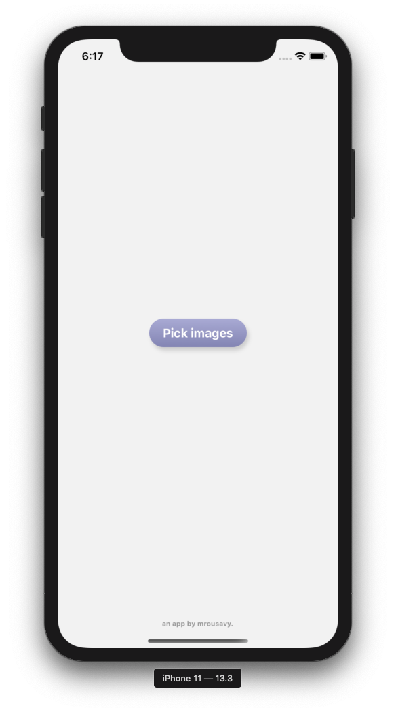
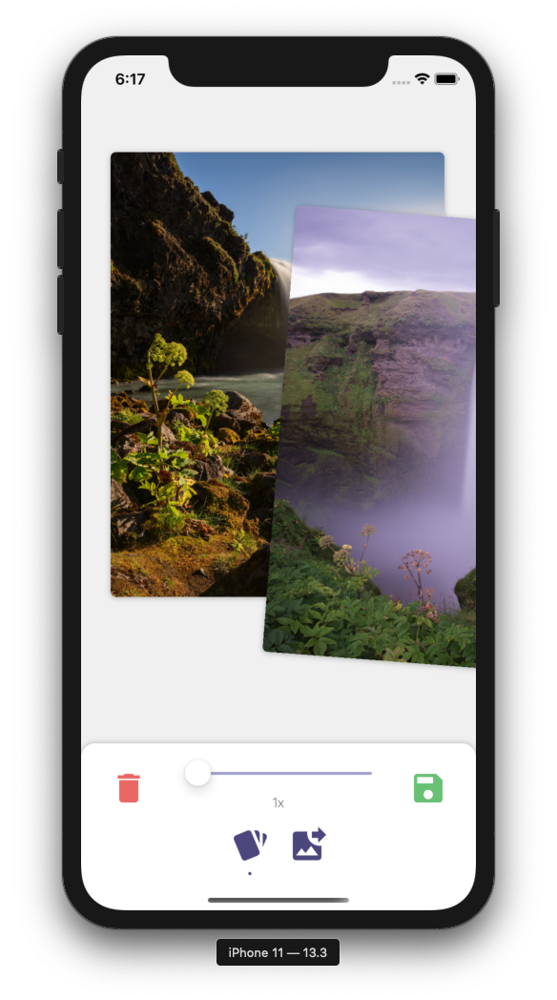

# Keepr

An app to compare photos one by one and decide what to keep and what to delete. Perfect for picking the best image out of a series after a photoshoot.

<div>
    
    
</div>

> this app is still work in progress.

## Working on iOS with different development teams

If you want to work with different developer teams - in case you have not applied for a "Apple Developer Program" Membership, you can execute the following command, to ignore certain parts in Xcode's configuration:
```
git config --global filter.pbxproj.smudge 'sed -E -e "s/DEVELOPMENT_TEAM|PRODUCT_BUNDLE_IDENTIFIER*/g"'
```
